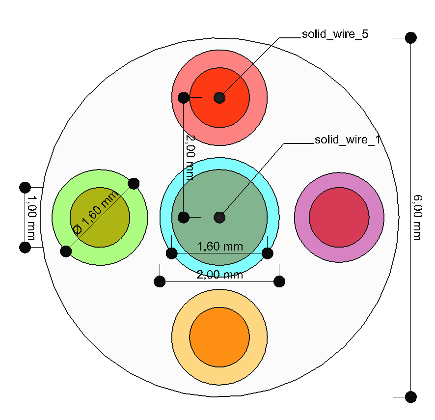
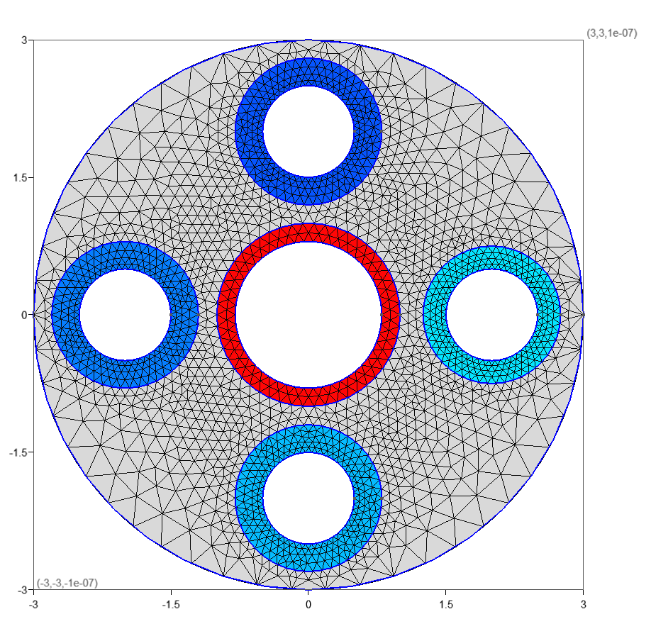

# Tulip
[](https://github.com/OpenSEMBA/tulip/actions/workflows/windows-builds-and-tests.yml)

[](https://github.com/OpenSEMBA/tulip/actions/workflows/ubuntu-builds-and-tests.yml)

**Tulip** (**T**ransmission line **u**nit **l**ength conductors and **i**n-cell **p**arameters) is a solver to obtain the _per unit length_ (PUL) $C$ and $L$ matrices which characterize electromagnetic propagation within a multiconductor tranmission line (MTL). Tulip is based on finite element methods to solver an electroestatic problem for each conductor. Some of its features are:
- Calculation of p.u.l $C$ and $L$ matrices.
- Third order isoparametric elements. 
- Support for dielectric materials.
- Open boundary conditions.
- Works on closed, open, or semiopen MTL.
- Multilevel domain decomposition.
- Uses a modified [MFEM](https://mfem.org/) solver engine available [here](https://github.com/OpenSEMBA/mfem).
- Result visualization with [Paraview](https://www.paraview.org/).
- Start from `.step` CAD files using the [step2gmsh](https://github.com/OpenSEMBA/step2gmsh) workflow.

## Compiling
Compilation needs vcpkg with the packages stated in the ```vcpkg.json``` manifest. 

Additionally needs:
- mfem (with the version pointed by the external/mfem-geg submodule)

### Compiling in windows (cmake)

#### Manually (Windows/Linux)
Compile mfem in external/mfem-geg

```shell
    cmake -S external/mfem-geg -B mfem-build/rls -DCMAKE_INSTALL_PREFIX=<path-to-mfem-install-dir>
    cmake --build mfem-build/rls --target install --config Release
```

Launch cmake in root.

```shell
    cmake -S . -B pulmtln-build/rls -DMFEM_DIR=<path-to-mfem-install-dir> -DCMAKE_TOOLCHAIN_FILE=<path-to-vcpkg/scripts/buildsystems/vcpkg.cmake>
    cmake --build pulmtln-build/rls --config Release
```

#### Compilation using presets
Configure and build presets are available. To configure

```shell 
    cmake 
        -DCMAKE_FIND_USE_PACKAGE_REGISTRY=FALSE  
        --preset "msbuild-vcpkg"
        -S <project folder>
        -B <build folder>
```

which requires the following environment variables to be set (using ```export```)

```shell
    VCPKG_ROOT=<vcpkg root folder>
    MFEM_PACKAGE=<mfem folder including cmake config package>
```

Using ```CMAKE_FIND_USE_PACKAGE_REGISTRY=FALSE``` warranties that no previously used package is used for compilation if any of the needed paths is not found (a questionable Windows _feature_). 

### Testing

Once compiled, test cases can be launched from the project root folder, with

```shell
   <build folder>/bin/Release/pulmtln_tests.exe 
```

Most cases will store results in the `Results` folder. 
Please check the codes in `test` folder for information on the validation cases and their expected tolerances.

## Usage example
Call `pulmtln` from command line as,

```shell
    pulmtln.exe -i <input file>
```

The input file must be describe a JSON object which describes the problem. An example for the `five_wires` case (available [here](testData/five_wires)) follows,

```json
    {
      "analysis": {
        "order": 3,
        "exportParaViewSolution": true,
        "exportFolder": "Results/five_wires/"
      },
      "model": {
        "materials": {
          "Conductor_0": {"type": "PEC", "tag": 1 },
          "Conductor_1": {"type": "PEC", "tag": 2 },
          "Conductor_2": {"type": "PEC", "tag": 3 },
          "Conductor_3": {"type": "PEC", "tag": 4 },
          "Conductor_4": {"type": "PEC", "tag": 5 },
          "Conductor_5": {"type": "PEC", "tag": 6 },
          "Dielectric_1": {"type": "Dielectric", "eps_r": 2.0, "tag": 8},
          "Dielectric_2": {"type": "Dielectric", "eps_r": 2.0, "tag": 9},
          "Dielectric_3": {"type": "Dielectric", "eps_r": 2.0, "tag": 10},
          "Dielectric_4": {"type": "Dielectric", "eps_r": 2.0, "tag": 11},
          "Dielectric_5": {"type": "Dielectric", "eps_r": 2.0, "tag": 12}
        },  
        "gmshFile": "five_wires.msh"
      }
    }
```

This object must contain the following entries: 

 + An `analysis` JSON object specifies options for the solver such as the `order` of the FEM basis and other exporting options.
 + A `model` JSON object which specifies 
   + the mesh through `gmshFile`. In this case the `five_wires.msh` file has been generated from a `.step` file using the [step2gmsh](https://github.com/OpenSEMBA/step2gmsh) program.
   + the `materials` object which identifies materials and boundaries assigned to each layer. The location in the mesh is done through its `tag` number which corresponds to a `physical model` in the mesh.

By default, `pulmtln` will generate a file called `matrices.pulmtln.out.json` which contains the $C$ and $L$ p.u.l parameters of the MTL. Each row and column corresponds to the `N` integer in `Conductor_N`. `Conductor_0` is used as reference. 
These results have been cross-compared [here][test/DriverTest.cpp] to match with [Ansys Maxwell](https://www.ansys.com/products/electronics/ansys-maxwell). 
Comparison with [SACAMOS](https://www.sacamos.org/) does not produce satisfactory because of the different underlying analytical assumptions that are made.


If `ExportParaviewSolution` is defined as `true` in `analysis`, `pulmtln` will also export visualization results for each simulation performed.
This means two results for each conductor different from zero: with and without accounting for dielectrics, used to compute the p.u.l $C$ and $L$ matrices, respectively.
Below there is an example of the electric fields for the `five_wires` case visualized in Paraview with (above) and without (below) considering dielectrics.


## License and copyright
``` pulmtln ``` is licensed under [BSD 3-Clause](LICENSE). Its copyright belongs to the University of Granada. 

## Acknowledgements
This project is funded by the following grants:

- HECATE - Hybrid ElectriC regional Aircraft distribution TEchnologies. HE-HORIZON-JU-Clean-Aviation-2022-01. European Union.
- ESAMA - Metodos numericos avanzados para el analisis de materiales electricos y magneticos en aplicaciones aerospaciales. PID2022-137495OB-C31. Spain.
# step2gmsh

[](https://github.com/lmdiazangulo/step2gmsh/actions/workflows/tests.yml)

`step2gmsh` is a collection of python scripts to generate [MFEM](https://mfem.org/) compatible meshes from step files using calls to [gmsh mesher](https://gmsh.info/).

The main usage is to generate 2D finite element method (FEM) meshes which can be used to solve electrostatic/magnetostatic problems.

## Installation

Install requirements with

```shell
    python -m pip install -r requirements.txt
```

## Usage

Step2gmsh requires two diferent files: 
- A json file where material properties are described for each geometry
- A step file with all the geometry info

Both files must have the same label and share folder path.
An example of those files can be found in [Five wires case](testData/five_wires/)

Launch from command line as

```shell
    python src/step2gmsh.py <-i path_to_step_file>
```

The tested input step files have been generated with [FreeCAD](https://www.freecad.org/). The geometrical entities within the step file must be separated in layers. The operations performed on the different layers depend on their material asignment registered in the json file.

- A layer with a `PEC material`, represent a perfect conductor. In case one of the layers surrounds the rest of elements, it will be asigned as ground and defines the global domain for the rest of conductors. Internally, this will be represented as Conductor_0. The areas of the rest of conductors different to zero will be substracted from the computational domain and removed. In open cases, Conductor_0 is just another conductor and the domain is defined using the bounding box of the layers.
- Layers registered as `Dielectric` are used to identify regions which will have a material assigned.
- Open and semi-open problems can be defined using a single layer called `OpenBoundary`.

Below is shown an example of a closed case with 6 conductors and 5 dielectrics, the external boundary corresponds to `Conductor_0`. The case is modeled with FreeCAD and can be found in the [testData/five_wires](testData/five_wires/) folder together with the exported as a step file. The resulting mesh after applying `step2gmsh` is shown below.




## License and copyright

``` step2gmsh ``` is licensed under [GNU GENERAL PUBLIC LICENSE Version 2](LICENSE), its copyright belongs to the University of Granada.

## Acknowledgments

This project is funded by the following grants:

- HECATE - Hybrid ElectriC regional Aircraft distribution TEchnologies. HE-HORIZON-JU-Clean-Aviation-2022-01. European Union.
- ESAMA - Métodos numéricos avanzados para el análisis de materiales eléctricos y magnéticos en aplicaciones aerospaciales. PID2022-137495OB-C31. Spain.