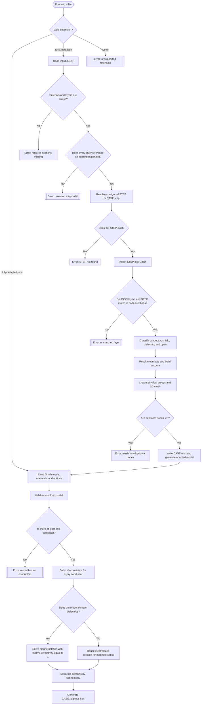
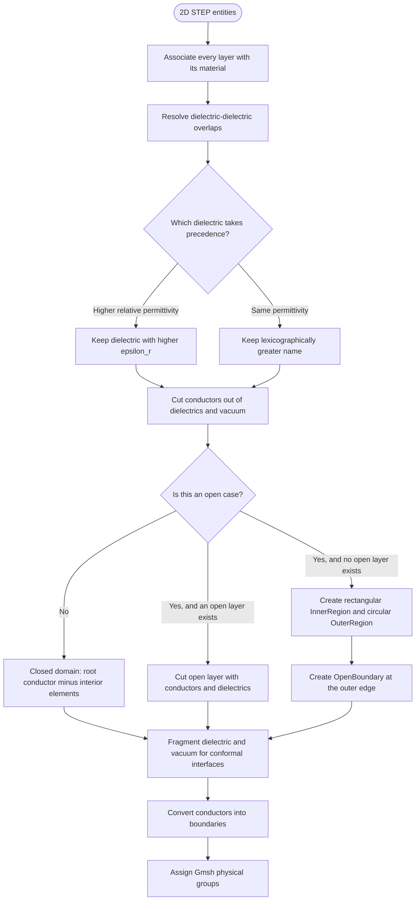
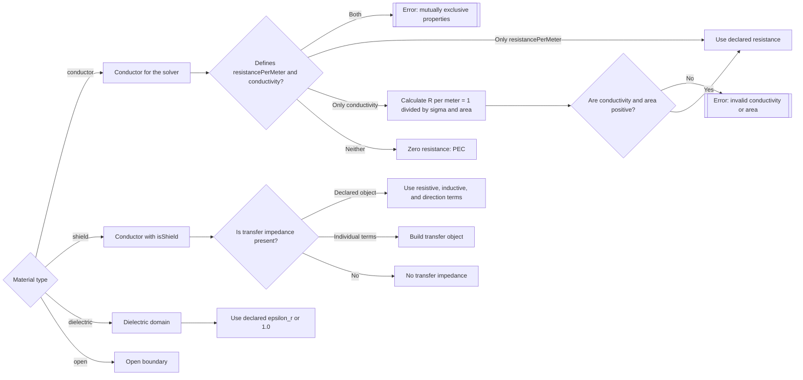
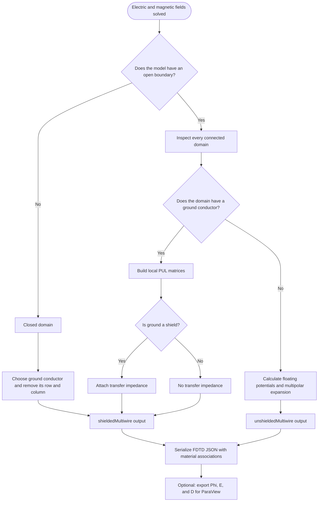
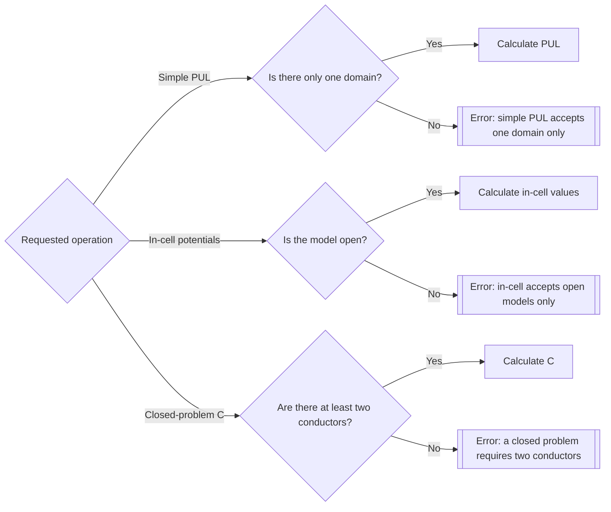

# Supported Tulip Workflows

This document describes the paths implemented by the current code. Tulip analyzes 2D cross sections of multiconductor transmission lines and computes per-unit-length parameters or in-cell reconstruction data for open domains.

## Complete Flow

## Geometry Adaptation

`shield` is supplied to the solver as a conductor, with additional transfer-impedance information when declared. A dielectric without `relativePermittivity` uses 1.0. A conductor without resistance or conductivity is treated as PEC.

Tulip classifies a case as open if there is a single `open`, the geometry has no single root conductor enclosing elements, the root is a dielectric, or in certain shield configurations with more than two non-intersecting conductors. Otherwise, it attempts to construct a closed domain from the root conductor.

## Materials and Properties

## Per-Domain Solution and Results

For each conductor, Tulip applies 1 V to the excited conductor and 0 V to the others. It builds the generalized capacitance matrix from the resulting charges. The magnetostatic solution ignores dielectric permittivities; `L` is derived from the inverse of the equivalent vacuum capacitance.

| Geometry | Expected result |
| --- | --- |
| Coaxial cable or several conductors inside an outer conductor | Closed domain and `R`, `L`, `C` matrices without the reference conductor |
| Conductors without an enclosure, with an `open` boundary | Open domain and `unshieldedMultiwire` reconstruction |
| Conductors without an enclosure or `open` boundary | Open domain with automatically generated inner/outer regions and boundary |
| Conductors inside a shield, with open exterior | Internal PUL domain plus external open domain |
| Geometry with several nested shields | One output per connected domain; every internal domain uses its ground |
| Touching or overlapping dielectrics | Conformal interfaces; overlapping dielectrics use the one with higher permittivity |

## Relevant Restrictions and Errors

The test cases in `test/adapter` and `test/driver` cover, among others, empty and partially filled coaxial cables, shielded and unshielded multiwire configurations, dielectrics, open boundaries, nested geometry, and in-cell parameters.
